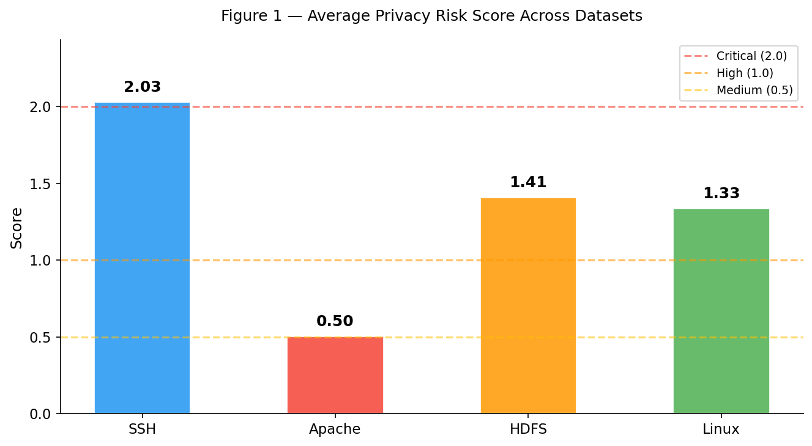
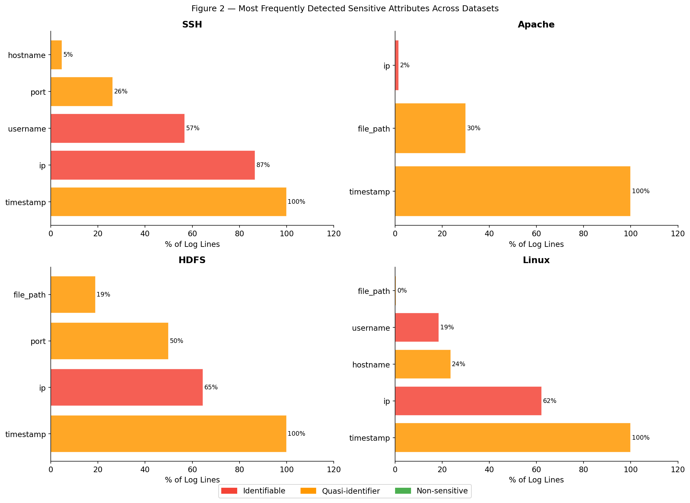

# Privacy Risk Scoring Tool for Software Logs
Paper: [Protecting Privacy in Software Logs: What Should Be Anonymized?](https://dl.acm.org/doi/10.1145/3715779) <br>

The paper above mentions as future directions to develop a privacy score for software logs. So, for this project, I developed a new tool: a CLI tool that scores the privacy risk of software log files by detecting sensitive attributes in each log line and computing a deterministic weighted risk score. Designed to help organizations identify which log files require anonymization before external sharing.


## Scoring Model
There are four risk levels with fixed thresholds: LOW (< 0.50), MEDIUM (0.50–0.99), HIGH (1.00–1.99), CRITICAL (≥ 2.00). 

The sensitive attributes detected by this tool are inspired from the taxonomy defined in the paper, which identify which log attributes are considered sensitive by industry practitioners and the academic literature. 

Attributes are classified into three tiers with uniform weights within each:

- **Direct identifiers** (IP, MAC, username) receive weight 1.00 because they each independently satisfy the GDPR Art. 4 identification threshold without requiring combination; a single direct identifier alone always reaches HIGH.
- **Quasi-identifiers** (hostname, timestamp, port, file path, URL, user/session/device ID) receive weight 0.30 because they require combination to enable re-identification, following Sweeney (2002); one or two quasi-identifiers stays LOW or MEDIUM and a combination of at least three is required to reach HIGH. 
- **Non-sensitive attributes** (log level, protocol, component, process ID) receive weight 0.05, reflecting minimal but non-zero contribution to the overall privacy surface, as noted by Aghili et al. (2025). 

The risk score is computed as:
```
score = Σ(direct weights) + Σ(quasi weights) + Σ(non-sensitive weights) + quasi_bonus + direct_bonus

quasi_bonus  = 0.15 × (q_count − 1)   when q_count ≥ 2 
direct_bonus = 0.15 × (d_count − 1)   when d_count ≥ 2
```

Example 1

```
Detected:
  Direct    : ip, username          → 1.00 + 1.00 = 2.00
  Quasi     : timestamp             → 0.30 × 1    = 0.30
  Non-sens  : log_level             → 0.05 × 1    = 0.05
  Amplifier : d_count=2 → 0.15×1   =              0.15
                                              ─────────
  Total score                                    2.50  [CRITICAL]
```


Example 2
```
Detected:
  Direct    : none                  →              0.00
  Quasi     : timestamp, file_path  → 0.30 + 0.30 = 0.60
  Non-sens  : log_level             → 0.05 × 1    = 0.05
  Amplifier : q_count=2 → 0.15×1   =              0.15
                                              ─────────
  Total score                                    0.80  [MEDIUM]
```


## Evaluation
The tool was evaluated on four [LogHub](https://github.com/logpai/loghub) datasets: SSH, Apache, HDFS, and Linux. 

Figures 1 and 2 show SSH logs score highest (2.03, CRITICAL) due to IP addresses in 87% of lines and usernames in 57%. Apache scores lowest (0.50, MEDIUM) since its error logs contain almost no direct identifiers, only timestamps and occasional file paths. HDFS (1.41) and Linux (1.33) both reach HIGH, driven by IP addresses in 65% and 62% of lines respectively. 

<div align="center">
  
</div>

<br>



## Usage
**Step 0 — Clone repository and install dependencies**<br>
**Step 1 — Score a log file:**<br>
```bash
python main.py datasets/<logname>.log_structured.csv
```
Each run saves a report (`results/<logname>_report.txt`) and scored lines (`results/<logname>_results.json`) for visualization.

**Step 2 — Generate figures:**<br>
```bash
python scripts/visualizations.py
```
